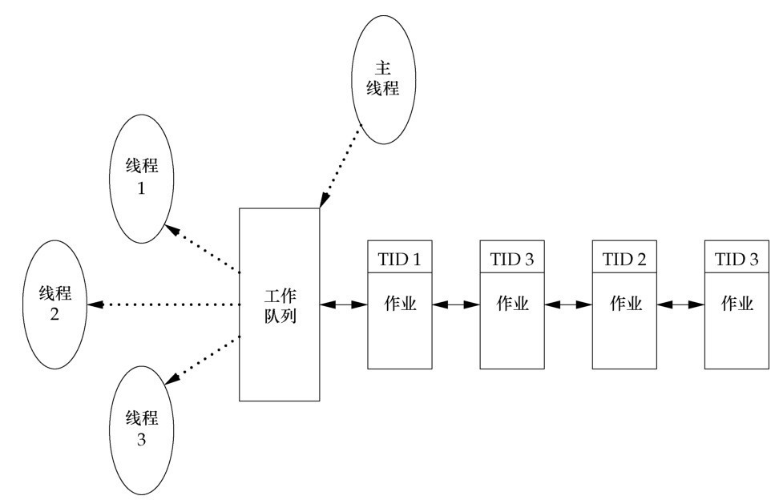
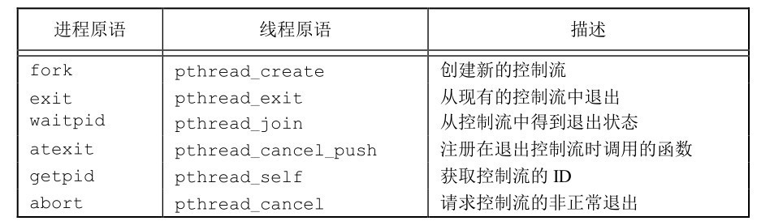

# 第十一章 线程

[toc]

#### 11.2 线程概念

典型的UNIX进程可以看成只有一个控制线程：一个进程在某一时刻只能做一件事情。
有了多个控制线程以后，在程序设计时就可以把进程设计成在某一时刻能够做不止一件事，
每个线程处理各自独立的任务。这种方法有很多好处。

#### 11.3 线程标识

**`pthread_t`由于有不同的实现方式，所以不能直接比较**

```c
#include <pthread.h>

int pthread_equal(pthread_t tid1, pthread_t tid2);
// 获取自身
pthread_t pthread_self(void);
```



#### 11.4 线程创建

```c
#include <pthread.h>
int pthread_create(pthread_t * tidp, const pthread_attr_t * attr, 
                        void *(*start_rtn)(void *), void * arg);
```

+ tidp: 回填地址
+ attr: 指定属性
+ start_rtn: 运行函数
+ arg: 函数参数


#### 11.5 线程终止

**三种方式**

1. 从启动例程返回
2. 被同一进程中其他线程取消
3. 线程调用`pthread_exit()`函数



**栈清理**

```c
#include <pthread.h>

void pthread_cleanup_push(void (*routine)(void *), void *arg);
void pthread_cleanup_pop(int execute);
```

**线程取消**

`pthread_cancel(pthread_t thread);`

推迟`cancel`: 引发阻塞的系统调用之前

**线程分离**

pthread_detach()

#### 11.6 线程同步

##### 11.6.1 互斥量

可以使用 pthread 的互斥接口来保护数据，确保同一时间只有一个线程访问数据。
互斥量（mutex）从本质上说是一把锁，在访问共享资源前对互斥量进行设置（加锁），在访问完成后释放（解锁）互斥量。
对互斥量进行加锁以后，任何其他试图再次对互斥量加锁的线程都会被阻塞直到当前线程释放该互斥锁。
如果释放互斥量时有一个以上的线程阻塞，那么所有该锁上的阻塞线程都会变成可运行状态，第一个变为运行的线程就可以对互斥量加锁，其他线程就会看到互斥量依然是锁着的，只能回去再次等待它重新变为可用。在这种方式下，每次只有一个线程可以向前执行。

```c
#include <pthread.h>

// 初始化
int pthread_mutex_init(pthread_mutex_t *restrict mutex, 
                    const pthread_mutexattr_t *restrict attr);
int pthread_mutex_destroy(pthread_mutex_t *mutex);

// 上锁
int pthread_mutex_lock(pthread_mutex_t *mutex);
int pthread_mutex_trylock(pthread_mutex_t *mutex);
int pthread_mutex_unlock(pthread_mutex_t *mutex);
```

##### 11.6.2 避免死锁

##### 11.6.3 函数pthread_mutex_timedlock

##### 11.6.4 读写锁

读写锁可以有3种状态：读模式下加锁状态，写模式下加锁状态，不加锁状态。一次只有一个线程可以占有写模式的读写锁，但是多个线程可以同时占有读模式的读写锁。

当读写锁是写加锁状态时，在这个锁被解锁之前，所有试图对这个锁加锁的线程都会被阻塞。
当读写锁在读加锁状态时，所有试图以读模式对它进行加锁的线程都可以得到访问权，但是任何希望以写模式对此锁进行加锁的线程都会阻塞，直到所有的线程释放它们的读锁为止。

```c
#include <pthread.h>

int pthread_rwlock_init(pthread_rwlock_t *restrict rwlock, const pthread_rwlockattr_t *restrict attr);
int pthread_rwlock_destroy(pthread_rwlock_t *rwlock);

int pthread_rwlock_rdlock(pthread_rwlock_t *rwlock);
int pthread_rwlock_wrlock(pthread_rwlock_t *rwlock);
int pthread_rwlock_unlock(pthread_rwlock_t *rwlock);
```

##### 11.6.5 带有超时的读写锁

##### 11.6.6 条件变量

```c
#include <pthread.h>

// 等待cond解锁
int pthread_cond_wait(pthread_cond_t *restrict cond, pthread_mutex_t *restrict mutex);
int pthread_cond_timedwait(pthread_cond_t *restrict cond, pthread_mutex_t *restrict mutex, 
                            const struct timespec *restrict tsptr);

// 发给至少一个线程
int pthread_cond_signal(pthread_cond_t *cond);
// 发给所有
int pthread_cond_broadcast(pthread_cond_t *cond);
```

##### 11.6.7 自旋锁

##### 11.6.8 屏障

# 补充

#### 信号量

> 参见 `sem_primer`

#### 线程属性

```c
#include <pthread.h>

int pthread_attr_init(pthread_attr_t *attr);
int pthread_attr_destroy(pthread_attr_t *attr);
```


