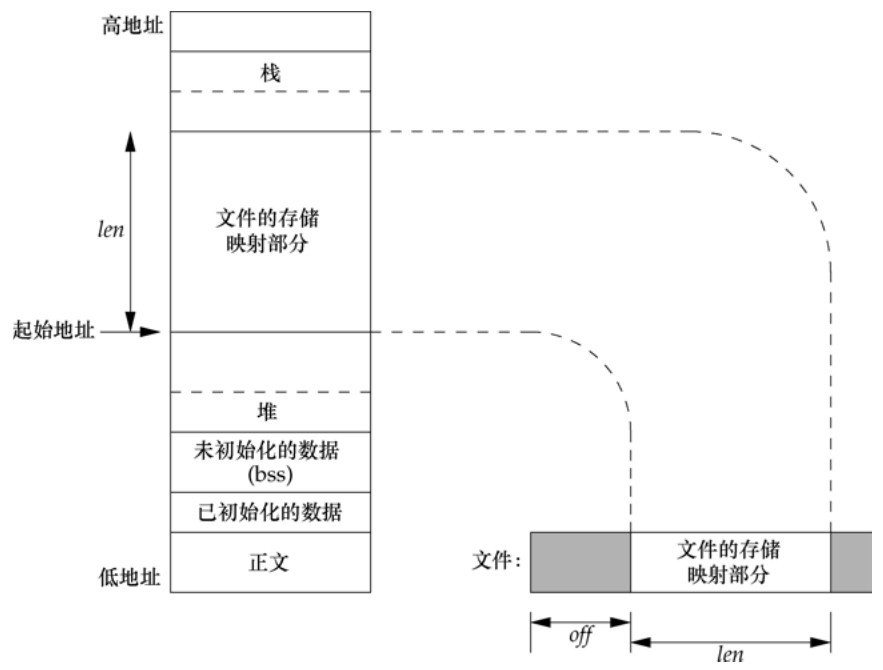

# 第14章 高级I/O

[toc]

#### 14.2 非阻塞I/O

#### 14.3 记录锁

fcntl()
lockf()
flock()

#### 14.4 I/O多路转接

##### 14.4.1 函数select和pselect

```c
#include <sys/select.h>

int select(int nfds, fd_set *restrict readfds,
       fd_set *restrict writefds, fd_set *restrict errorfds,
       struct timeval *restrict timeout);
```

**两个结构体：**

1. **`struct fd_set`** 集合 存放的是文件描述符。`fd_set`集合可以通过一些宏由人为来操作，比如清空集合`FD_ZERO(fd_set *)`，将一个给定的文件描述符加入集合之中`FD_SET(int ,fd_set*)`，将一个给定的文件描述符从集合中删除`FD_CLR(int,fd_set*)`，检查集合中指定的文件描述符是否可以读写`FD_ISSET(int ,fd_set* )`

2. **`struct timeval`** 代表时间值，有两个成员，一个是秒数，另一个是毫秒数。 

**`select`的参数**

- `int maxfdp` 集合中所有文件描述符的范围，即所有文件描述符的最大值加1

- `fd_set * readfds` 指向`fd_set`结构的指针，这个集合中应该包括文件描述符，我们是要监视这些文件描述符的读变化的，即我们关心是否可以从这些文件中读取数据了，如果这个集合中有一个文件可读，select就会返回一个大于0的值，表示有文件可读，如果没有可读的文件，则根据timeout参数再判断是否超时，若超出timeout的时间，select返回0，若发生错误返回负值。可以传入NULL值，表示不关心任何文件的读变化。 

- `fd_set * writefds` 是指向`fd_set`结构的指针，这个集合中应该包括文件描述符，我们是要监视这些文件描述符的写变化的，即我们关心是否可以向这些文件中写入数据了，如果这个集合中有一个文件可写，select就会返回一个大于0的值，表示有文件可写，如果没有可写的文件，则根据timeout参数再判断是否超时，若超出timeout的时间，select返回0，若发生错误返回负值。可以传入NULL值，表示不关心任何文件的写变化。 

- `struct timeval * timeout` select的超时时间，这个参数至关重要，它可以使select处于三种状态
    + 第一，若将NULL以形参传入，即不传入时间结构，就是将select置于阻塞状态，一定等到监视文件描述符集合中某个文件描述符发生变化为止；
    + 第二，若将时间值设为0秒0毫秒，就变成一个纯粹的非阻塞函数，不管文件描述符是否有变化，都立刻返回继续执行，文件无变化返回0，有变化返回一个正值；
    + 第三，timeout的值大于0，这就是等待的超时时间，即select在timeout时间内阻塞，超时时间之内有事件到来就返回了，否则在超时后不管怎样一定返回，返回值同上述。 

**返回值**

*返回状态发生变化的描述符总数*
- 负值：select错误
- 正值：某些文件可读写或出错
- 0：等待超时，没有可读写或错误的文件

##### 14.4.2 函数poll

```c
#include <poll.h>

struct pollfd {
    int fd;
    short events;
    short revents;
};

int poll(struct pollfd fds[], nfds_t nfds, int timeout);
```

**参数**

1. timeout == -1 永远等待。当所指定的描述符中的一个已准备好，或捕捉到一个信号时返回。如果捕捉到一个信号，则poll返回-1，errno设置为EINTR。
2. timeout == 0 不等待。测试所有描述符并立即返回。这是一种轮询系统的方法，可以找到多个描述符的状态而不阻塞poll函数。
3. timeout > 0 等待timeout毫秒。当指定的描述符之一已准备好，或timeout到期时立即返回。如果timeout到期时还没有一个描述符准备好，则返回值是0。


##### 补充 函数epoll

#### 14.5 异步I/O

##### 14.5.1 System V异步I/O

##### 14.5.2 BSD异步I/O

##### 14.5.3 POSIX异步I/O

#### 14.6 函数readv和writev

**写或读多个地址**

```c
#include <sys/uio.h>

struct iovec {
   void *iov_base;
   size_t iov_len;
};

ssize_t readv(int fd, const struct iovec *iov, int iovcnt);
ssize_t writev(int fd, const struct iovec *iov, int iovcnt);
```

#### 14.7 函数readn和writen

**坚持读够或写够n个字节**

*apue 实现*

#### 14.8 存储映射I/O



```c
#include <sys/mman.h>

void *mmap(void *addr, size_t length, int prot, int flags,
          int fd, off_t offset);
int munmap(void *addr, size_t length);
```

进程间共享内存

# 补充

#### 有限状态机

简单流程：自然流程结构化

复杂流程：自然结果非结构化
