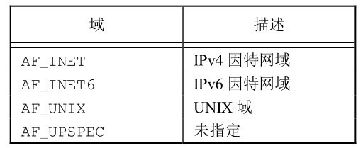
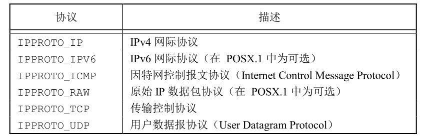

# 第十六章 网络IPC: 套接字

[toc]

#### 16.2 套接字描述符

```c
#include <sys/socket.h>

int socket (int domain, int type, int protocol);
```





##### 问题

1. 字节序问题

    + 大端存储: 低地址放高字节

    + 主机字节序 host

    + 网络字节序 network

    + 小端存储: 低地址放低字节

    - 解决方法: 使用函数 `htos`,`stohl` ...

2. 对齐

3. 类型长度

    + **`int`在不同机器中字节大小不同**

    + 解决: 使用`int8_t`, `uint8_t` ...


#### 16.3 寻址

##### 16.3.1 字节序

##### 16.3.2 地址格式

报式套接字

socket()
bind()
sendto()
rcvfrom()
inet_pton()
inet_ntop()

多点通讯：
广播 多播 组播

流式套接字


# 补充

#### 函数`inet_pton`

**IP地址格式转换**

```c
#include <arpa/inet.h>

int inet_pton(int af, const char *src, void *dst);
```
