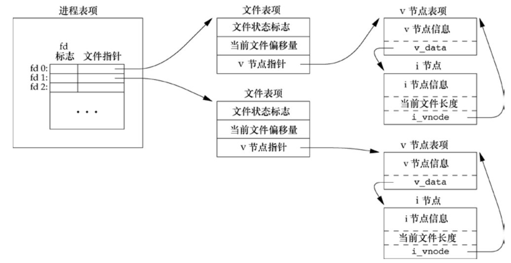
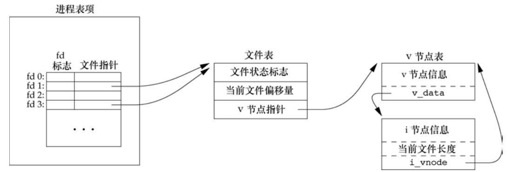

# 第三章 文件I/O

[toc]

#### 3.1 引言

open, read, write, lseek, close

#### 3.2 文件描述符号

- 数组下标->文件指针
- 当打开文件或创建文件时返回非负整数（文件描述符号）
- `STDIN_FILENO: 0; STDOUT_FILENO: 1; STDERR_FILENO: 2;`

#### 3.3 函数`open`和`openat`

```c
#include <fcntl.h>

int open(const char *path, int oflag, ...);
int openat(int fd, const char *path, int oflag, ...);
```
**必须指定且只能指定一个**
| oflag      | 含义               |
| :-------:  | :--------:         |
| `O_RDONLY` | 只读打开           |
| `O_WRONLY` | 只写打开           |
| `O_RDWR`   | 读写打开           |
| `O_EXEC`   | 只执行打开         |
| `O_SEARCH` | 只搜索打开（目录） |

**`open`与`openat`区别**

1. path参数为绝对路径名，fd参数忽略，openat = open。
2. path参数为相对路径名，fd参数通过打开相对路径名所在的目录获取。

#### 3.4 函数`creat`

```c
#include <fcntl.h>

int create(const char *path, mode_t mode);
// 相当于
int open(const char *path, O_WRONLY | O_CREATE | O_TRUNC, mode);
```

#### 3.5 函数`close`

```c
#include <fcntl.h>

int close(int fd);
```

#### 3.6 函数`lseek`

每个打开文件都有一个与其相关联的“当前文件偏移量”（current file offset）。
它通常是一个非负整数，用以度量从文件开始处计算的字节数。
通常，读、写操作都从当前文件偏移量处开始，并使偏移量增加所读写的字节数。
按系统默认的情况，当打开一个文件时，除非指定O_APPEND选项，否则该偏移量被设置为0。
```c
#include <unistd.h>

// 返回新的偏移量
off_t lseek(int fd, off_t offset, int whence);
```
**offset**
- 可以大于文件当前长度，形成空洞

**whencw**
- `SEEK_SET`: 则将该文件的偏移量设置为距文件开始处offset个字节。
- `SEEK_CUR`，则将该文件的偏移量设置为其当前值加offset，offset可为正或负。
- `SEEK_END`，则将该文件的偏移量设置为文件长度加offset，offset可正可负。

#### 3.7 函数`read`

```c
#include <unistd.h>

// read成功，则返回读到的字节数
// 已到达文件的尾端，则返回0
// void * 通用指针
size_t read(int fd, void *buf size_t nbytes);
```

#### 3.8 函数`write`

```c
#include <unistd.h>

// 返回写入的字节数
size_t write(int fd, void *buf size_t nbytes);
```

#### 3.10 文件共享


**表示打开文件的数据结构** 
1. 每个进程在进程表中都有一个记录项，记录项中包含一张打开文件描述符表，可将其视为一个矢量，每个描述符占用一项。与每个文件描述符相关联的是：
    - 文件描述符标志（close_on_exec，参见图3-7和3.14节）；
    - 指向一个文件表项的指针。
2. 内核为所有打开文件维持一张文件表。每个文件表项包含：
    - 文件状态标志（读、写、添写、同步和非阻塞等，关于这些标志的更多信息参见3.14节）；
    - 当前文件偏移量；
    - 指向该文件v节点表项的指针。
3. 每个打开文件（或设备）都有一个 v 节点（v-node）结构。v 节点包含了文件类型和对此文件进行各种操作函数的指针。对于大多数文件，v节点还包含了该文件的i节点（i-node，索引节点）。这些信息是在打开文件时从磁盘上读入内存的，所以，文件的所有相关信息都是随时可用的。

#### 3.11 原子操作

###### 1. 追加到一个文件
UNIX系统为这样的操作提供了一种原子操作方法，即在打开文件时设置O_APPEND标志。
正如前一节中所述，这样做使得内核在每次写操作之前，都将进程的当前偏移量设置到该文件的尾端处，于是在每次写之前就不再需要调用lseek。

###### 2. 函数`pread`和`pwrite`
```c
#include <unistd.h>

// 返回值：读到的字节数，若已到文件尾，返回0；若出错，返回−1
ssize_t pread(int fd, void *buf, size_t nbytes, off_t offset);
// 返回值：若成功，返回已写的字节数；若出错，返回−1
ssize_t pwrite(int fd, const void *buf, size_t nbytes, off_t offset);
```
相当于调用lseek后再调用

**区别**
- 调用时，无法中断其定位和读操作。
- 不更新当前文件偏移量。

#### 3.12 函数`dup`和`dup2`

**两个函数都可用来复制一个现有的文件描述符。**
```c
#include <unistd.h>

int dup(int fd);
int dup2(int fd, int fd2);
```


由dup返回的新文件描述符一定是当前可用文件描述符中的最小数值。
对于 dup2，可以用fd2参数指定新描述符的值。如果fd2已经打开，则先将其关闭。
如若fd等于fd2，则dup2返回fd2，而不关闭它。
否则，fd2的FD_CLOEXEC文件描述符标志就被清除，这样fd2在进程调用exec时是打开状态。

#### 3.13 函数`sync`、`fsync`和`fdatasync`

```c
#include <unistd.h>

void sync(void);
// 成功 0  错误 -1
int fsync(int fd);
int fdatasync(int fd);
```

#### 3.14 函数`fcntl`

**改变已经打开文件的属性**
```c
#include <fcntl.h>

// 成功返回值与cmd有关  错误返回 -1
int fcntl(int fd, int cmd, ...);
```
**fcntl函数有以下5种功能。**
1. 复制一个已有的描述符（cmd=F_DUPFD或F_DUPFD_CLOEXEC）。
2. 获取/设置文件描述符标志（cmd=F_GETFD或F_SETFD）。
3. 获取/设置文件状态标志（cmd=F_GETFL或F_SETFL）。
4. 获取/设置异步I/O所有权（cmd=F_GETOWN或F_SETOWN）。
5. 获取/设置记录锁（cmd=F_GETLK、F_SETLK或F_SETLKW）。

**F_DUPFD** 
- 复制文件描述符fd。新文件描述符作为函数值返回。
它是尚未打开的各描述符中大于或等于第3个参数值（取为整型值）中各值的最小值。
新描述符与 fd共享同一文件表项。但是，新描述符有它自己的一套文件描述符标志。

**F_DUPFD_CLOEXEC**
- 复制文件描述符，设置与新描述符关联的FD_CLOEXEC文件描述符标志的值，返回新文件描述符。

**F_GETFD**
- 对应于fd的文件描述符标志作为函数值返回。当前只定义了一个文件描述符标志FD_CLOEXEC。

**F_SETFD**
- 对于fd设置文件描述符标志。新标志值按第3个参数（取为整型值）设置。

**F_GETFL**
- 对应于fd的文件状态标志作为函数值返回。

    *遗憾的是，5个访问方式标志（O_RDONLY、O_WRONLY、O_RDWR、O_EXEC以及O_SEARCH）
    并不各占1位（如前所述，由于历史原因，前3个标志的值分别是0、1和2。
    这5个值互斥，一个文件的访问方式只能取这5个值之一）。
    因此首先必须用屏蔽字O_ACCMODE取得访问方式位，然后将结果与这5个值中的每一个相比较。*

**F_SETFL**
- 将文件状态标志设置为第3个参数的值（取为整型值）。可以更改的几个标志是：O_APPEND、O_NONBLOCK、O_SYNC、O_DSYNC、O_RSYNC、O_FSYNC和O_ASYNC。

**F_GETOWN**
- 获取当前接收SIGIO和SIGURG信号的进程ID或进程组ID。14.5.2节将论述这两种异步I/O信号。

**F_SETOWN**
- 设置接收SIGIO和SIGURG信号的进程ID或进程组ID。正的arg指定一个进程ID，负的arg表示等于arg绝对值的一个进程组ID。

    *fcntl的返回值与命令有关。如果出错，所有命令都返回－1，如果成功则返回某个其他值。
    下列4个命令有特定返回值：F_DUPFD、F_GETFD、F_GETFL以及F_GETOWN。
    第1个命令返回新的文件描述符，第2个和第3个命令返回相应的标志，最后一个命令返回一个正的进程ID或负的进程组ID。*

#### 3.15 函数`ioctl`

```c
#include <sys/ioctl.h>

int ioctl(int fd, int request, ...);
```

