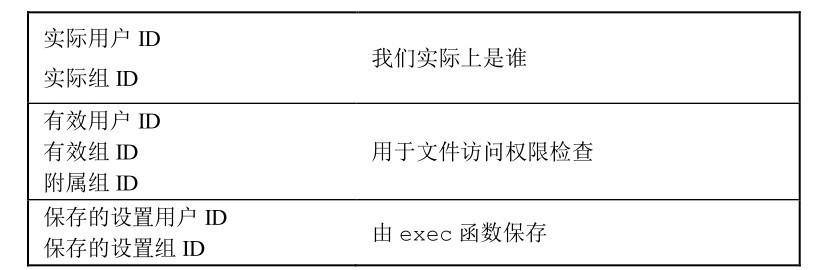
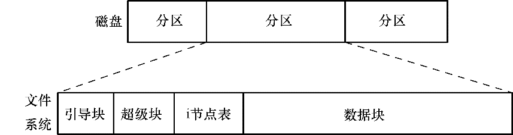
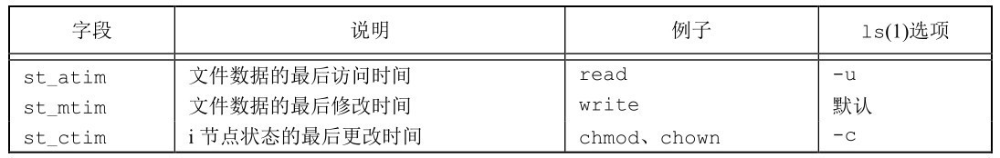
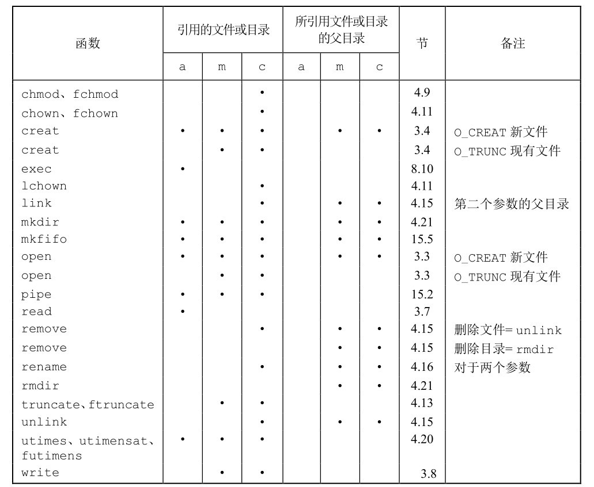

# 第四章 文件和目录

[toc]

#### 4.2 函数`stat`、`fstat`、`fstatat`和`lstat`

```c
#include <sys/stat.h>

// 所有4个函数的返回值：若成功；返回0；若出错，返回-1
int stat(const char *restrict pathname, struct stat *restrict buf);
int fstat(int fd, struct stat *buf);
int lstat(const char *restrict pathname, struct stat *restrict buf);
int fstatat(int fd, const char *restrict pathname, struct stat *restrict buf, int flag);
```
**stat**
- 返回与此命名文件有关的信息结构。

**fstat**
- 获得已在描述符fd上打开文件的有关信息。

**lstat**
- 类似于stat，但是当命名的文件是一个符号链接时，lstat返回该符号链接的有关信息，而不是由该符号链接引用的文件的信息。

**fstatat**

- 为一个相对于当前打开目录（由fd参数指向）的路径名返回文件统计信息。
- flag参数控制着是否跟随着一个符号链接。
    + 当AT_SYMLINK_NOFOLLOW标志被设置时，fstatat不会跟随符号链接，而是返回符号链接本身的信息。
    + 否则，在默认情况下，返回的是符号链接所指向的实际文件的信息。
- 如果fd参数的值是AT_FDCWD，并且pathname参数是一个相对路径名， fstatat会计算相对于当前目录的pathname参数。如果pathname是一个绝对路径，fd参数就会被忽略。这两种情况下，根据flag的取值，fstatat的作用就跟stat或lstat一样

#### 4.3 文件类型

**文件类型包括如下几种**
1. **普通文件（regular file）** 这是最常用的文件类型，这种文件包含了某种形式的数据。至于这种数据是文本还是二进制数据，对于UNIX内核而言并无区别。对普通文件内容的解释由处理该文件的应用程序进行。
一个值得注意的例外是二进制可执行文件。为了执行程序，内核必须理解其格式。所有二进制可执行文件都遵循一种标准化的格式，这种格式使内核能够确定程序文本和数据的加载位置。
2. **目录文件（directory file）** 这种文件包含了其他文件的名字以及指向与这些文件有关信息的指针。对一个目录文件具有读权限的任一进程都可以读该目录的内容，但只有内核可以直接写目录文件。进程必须使用本章介绍的函数才能更改目录。
3. **块特殊文件（block special file）** 这种类型的文件提供对设备（如磁盘）带缓冲的访问，每次访问以固定长度为单位进行。
注意，FreeBSD不再支持块特殊文件。对设备的所有访问需要通过字符特殊文件进行。
4. **字符特殊文件（character special file）** 这种类型的文件提供对设备不带缓冲的访问，每次访问长度可变。系统中的所有设备要么是字符特殊文件，要么是块特殊文件。
5. **FIFO** 这种类型的文件用于进程间通信，有时也称为命名管道（named pipe）。15.5节将对其进行说明。
6. **套接字（socket）** 这种类型的文件用于进程间的网络通信。套接字也可用于在一台宿主机上进程之间的非网络通信。第16章将用套接字进行进程间的通信。
7. **符号链接（symbolic link）** 这种类型的文件指向另一个文件。4.17节将更多地描述符号链接。

#### 4.4 设置用户ID和设置组ID



- **实际用户ID和实际组ID** 标识我们究竟是谁。这两个字段在登录时取自口令文件中的登录项。通常，在一个登录会话期间这些值并不改变，但是超级用户进程有方法改变它们。
- **有效用户ID、有效组ID以及附属组ID** 决定了我们的文件访问权限。
- **保存的设置用户ID和保存的设置组ID** 在执行一个程序时包含了有效用户ID和有效组ID的副本。

    *通常，有效用户ID等于实际用户ID，有效组ID等于实际组ID。*

#### 4.5 文件访问权限

**访问权限位**

| st_mode屏蔽 | 含义      |
| :--------:  | :-------: |
| `S_IRUSR`   | 用户读    |
| `S_IWUSR`   | 用户写    |
| `S_IXUSR`   | 用户执行  |
| `S_IRGRP`   | 组读      |
| `S_IWGRP`   | 组写      |
| `S_IXGRP`   | 组执行    |
| `S_IROTH`   | 其他读    |
| `S_IWOTH`   | 其他写    |
| `S_IXOTH`   | 其他执行  |

1. 若进程的有效用户ID是0（超级用户），则允许访问。这给予了超级用户对整个文件系统进行处理的最充分的自由。
2. 若进程的有效用户ID等于文件的所有者ID（也就是进程拥有此文件），那么如果所有者适当的访问权限位被设置，则允许访问；否则拒绝访问。适当的访问权限位指的是，若进程为读而打开该文件，则用户读位应为1；若进程为写而打开该文件，则用户写位应为1；若进程将执行该文件，则用户执行位应为1。
3. 若进程的有效组ID或进程的附属组ID之一等于文件的组ID，那么如果组适当的访问权限位被设置，则允许访问；否则拒绝访问。
4. 若其他用户适当的访问权限位被设置，则允许访问；否则拒绝访问。

#### 4.7 函数`access`和`faccessat`

**access和faccessat函数是按实际用户ID和实际组ID进行访问权限测试**

```c
#include <unistd.h>

int access(const char *pathname, int mode);
int faccessat(int fd, const char *pathname, int mode, int flag);
```

#### 4.8 函数`umask`

**umask 函数为进程设置文件模式创建屏蔽字，并返回之前的值**

```c
#include <sys/stat.h>

// mode & (~cmask) = 110 110 110 & 111 111 111 = 110 110 110
mode_t umask(mode_t cmask);
```

#### 4.9 函数`chmod`、`fchmod`和`fchmodat`

**`chmod`、`fchmod`和`fchmodat`这3个函数使我们可以更改现有文件的访问权限**

```c
#include <sys/stat.h>

// 3个函数返回值：若成功，返回0；若出错，返回−1
int chmod(const char *pathname, mode_t mode);
int fchmod(int fd, mode_t mode);
int fchmodat(int fd, const char *pathname, mode_t mode, int flag);
```
- `chmod` 函数在指定的文件上进行操作。
- `fchmod` 函数则对已打开的文件进行操作。
- `fchmodat`函数与`chmod`函数在下面两种情况下是相同的：
    1. `pathname`参数为绝对路径，
    2. `fd`参数取值为`AT_FDCWD`而`pathname`参数为相对路径。
- `fchmodat`计算相对于打开目录（由`fd`参数指向）的`pathname`。
`flag`参数可以用于改变`fchmodat`的行为，当设置了`AT_SYMLINK_NOFOLLOW`标志时，`fchmodat`并不会跟随符号链接。

#### 4.10 粘着位

允许针对目录设置粘着位。

**如果对一个目录设置了粘着位，只有对该目录具有写权限的用户并且满足下列条件之一，才能删除或重命名该目录下的文件：**

- 拥有此文件
- 拥有此目录
- 是超级用户

    *目录/tmp 和/var/tmp 是设置粘着位的典型候选者—任何用户都可在这两个目录中创建文件。
    任一用户（用户、组和其他）对这两个目录的权限通常都是读、写和执行。
    但是用户不应能删除或重命名属于其他人的文件，为此在这两个目录的文件模式中都设置了粘着位。*

#### 4.11 函数`chown`、`fchown`、`fchownat`和`lchown`

```c
#include <unistd.h>

// 4个函数的返回值：若成功，返回0；若出错，返回-1
int chown(const char *pathname, uid_t owner, gid_t group);
int fchown(int fd, uid_t owner, gid_t group);
int fchownat(int fd, const char *pathname, uid_t owner, gid_t group, int flag);
int lchown(const char *pathname, uid_t owner, gid_t group);
```

- `fchown`函数改变fd参数指向的打开文件的所有者
- `fd`参数设置为打开目录的文件描述符，并且`pathname`参数是一个相对路径名，`fchownat`函数计算相对于打开目录的`pathname`。
- `fchownat`函数与`chown`或者`lchown`函数在下面两种情况下是相同的：
    - 一种是`pathname`参数为绝对路径
    - 另一种是`fd`参数取值为`AT_FDCWD`而`pathname`参数为相对路径。

    *在这两种情况下，如果`flag`参数中设置了`AT_SYMLINK_NOFOLLOW`标志，`fchownat`与`lchown`行为相同，如果`flag`参数中清除了`AT_SYMLINK_NOFOLLOW`标志，则`fchownat`与`chown`行为相同。*

#### 4.12 文件长度

**`st_size`** 
> 以字节为单位的文件长度，只对普通文件、目录文件和符号链接有意义

**`st_blksize`**
> 针对文件系统上文件进行I/O操作时的最优块大小（以字节为单位） 

**`st_blocks`**
> 分配给文件的总块数，块大小为512字节，取值将总是2、4、8的倍数

#### 4.13 文件截断

**在文件尾端处截去一些数据以缩短文件**
```c
#include <unistd.h>

int truncate(const char *pathname, off_t length);
int ftruncate(int fd, off_t length);
```

#### 4.14 文件系统



**引导块** 
-  总是作为文件系统的首块。引导块不为文件系统所用，只是包含用来引导操作系统的信息。操作系统虽然只需一个引导块，但所有文件系统都设有引导块（其中的绝大多数都未使用）。

**超级块**
- 紧随引导块之后的一个独立块，包含与文件系统有关的参数信息，其中包括：
    - i节点表容量
    - 文件系统中逻辑块的大小
    - 以逻辑块计，文件系统的大小；
    - 驻留于同一物理设备上的不同文件系统，其类型、大小以及参数设置（比如，块大小）都可以有所不同。这也是将一块磁盘划分为多个分区的原因之一。

**i节点表**
- 文件系统中的每个文件或目录在i节点表中都对应着唯一一条记录。

> **i节点维护的信息**
>    - 文件类型（比如，常规文件、目录、符号链接，以及字符设备等）。
>    - 文件属主（亦称用户ID或UID）。
>    - 文件属组（亦称为组ID或GID）。
>    - 3类用户的访问权限：属主（有时也称为用户）、属组以及其他用户（属主和属组用户之外的用户）。
>    - 3个时间戳：对文件的最后访问时间（ls –lu所显示的时间）、对文件的最后修改时间（也是ls –l所默认显示的时间），以及文件状态的最后改变时间（ls –lc所显示的最后改变i节点信息的时间）。值得注意的是，与其他UNIX实现一样，大多数Linux文件系统不会记录文件的创建时间。
>    - 指向文件的硬链接数量。
>    - 文件的大小，以字节为单位。
>    - 实际分配给文件的块数量，以 512 字节块为单位。这一数字可能不会简单等同于文件的字节大小，因为考虑文件中包含空洞（请参见4.7节）的情形，分配给文件的块数可能会低于根据文件正常大小（以字节为单位）所计算出的块数。
>    - 指向文件数据块的指针。

**数据块**
- 文件系统的大部分空间都用于存放数据，以构成驻留于文件系统之上的文件和目录。

#### 4.15 函数`link`、`linkat`、`unlink`、`unlinkat`和`remove`

```c
#include <unistd.h>

// 硬链接
int link(const char *existingpath, const char *newpath);
int linkat(int efd, const char *existingpath, int nfd, const char *newpathm int flag);
```

*当现有文件是符号链接时，由flag参数来控制linkat函数是创建指向现有符号链接的链接还是创建指向现有符号链接所指向的文件的链接。
如果在flag参数中设置了AT_SYMLINK_FOLLOW标志，就创建指向符号链接目标的链接。
如果这个标志被清除了，则创建一个指向符号链接本身的链接。*

```c
#include <unistd.h>

int unlink(const char *pathname);
int unlinkat(int fd, const char *pathname, int flag);
```

**`unlink`**
- 从文件系统中中删除一个名字，若这个名字是指向这个文件的最后一个链接，并且没有进程处于打开这个文件的状态，则删除这个文件，释放这个文件占用的空间。
- 如果这个名字是指向这个文件的最后一个链接，但有某个进程处于打开这个文件的状态，则暂时不删除这个文件，要等到打开这个文件的进程关闭这个文件的文件描述符后才删除这个文件。
- 如果这个名字指向一个符号链接，则删除这个符号链接。
- 如果这个名字指向一个socket、fifo或者一个设备，则这个socket、fifo、设备的名字被删除，当时打开这些socke、fifo、设备的进程仍然可以使用它们。

#### 4.16 函数`rename`和`renameat`

**文件或目录可以用rename函数或者renameat函数进行重命名**

```c
#include <stdio.h>

int rename(const char *oldname, const char *newname);
int renameat(int oldfd, const char *oldname, int newfd, const char *newname);
```

1. 如果oldname指的是一个文件而不是目录，那么为该文件或符号链接重命名。在这种情况下，如果newname已存在，则它不能引用一个目录。如果newname已存在，而且不是一个目录，则先将该目录项删除然后将 oldname 重命名为 newname。对包含 oldname 的目录以及包含newname的目录，调用进程必须具有写权限，因为将更改这两个目录。
2. 如若oldname指的是一个目录，那么为该目录重命名。如果newname已存在，则它必须引用一个目录，而且该目录应当是空目录（空目录指的是该目录中只有.和..项）。如果 newname存在（而且是一个空目录），则先将其删除，然后将oldname重命名为newname。另外，当为一个目录重命名时，newname不能包含oldname作为其路径前缀。例如，不能将/usr/foo重命名为/usr/foo/testdir，因为旧名字（/usr/foo）是新名字的路径前缀，因而不能将其删除。
3. 如若oldname或newname引用符号链接，则处理的是符号链接本身，而不是它所引用的文件。
4. 不能对.和..重命名。更确切地说，.和..都不能出现在oldname和newname的最后部分。
5. 作为一个特例，如果oldname和newname引用同一文件，则函数不做任何更改而成功返回。

#### 4.18 创建和读取符号链接

**符号链接是对一个文件的间接指针**

```c
#include <unistd.h>

// 函数创建了一个指向actualpath的新目录项sympath
int symlink(const char *actualapth, const char *sympath);
int symlinkat(const char *actualapth, int fd, const char *sympath);
```

```c
#include <unistd.h>

ssize_t readlink(const char *restrict pathname, char *restrict buf, size_t bufsize);
ssize_t readlinkat(int fd, const char* restrict pathname, char *restrict buf, size_t bufsize);
```

#### 4.19 文件的时间





#### 4.20 函数`futimes`、`utimensat`和`utimes`

```c
#include <sys/stat.h>

// times数组参数的第一个元素包含访问时间，第二元素包含修改时间
int futimes(int fd, const struct timespec times[2]);
int utimensat(int fd, const char *path, const struct timespec times[2], int flag);
```

**时间戳可以按下列4种方式之一进行指定**

1. 如果times参数是一个空指针，则访问时间和修改时间两者都设置为当前时间。
2. 如果times参数指向两个timespec结构的数组，任一数组元素的tv_nsec字段的值为UTIME_NOW，相应的时间戳就设置为当前时间，忽略相应的tv_sec字段。
3. 如果times参数指向两个timespec结构的数组，任一数组元素的tv_nsec字段的值为UTIME_OMIT，相应的时间戳保持不变，忽略相应的tv_sec字段。
4. 如果 times 参数指向两个 timespec 结构的数组，且 tv_nsec 字段的值为既不是UTIME_NOW 也不是 UTIME_OMIT，在这种情况下，相应的时间戳设置为相应的 tv_sec 和tv_nsec字段的值。

```c
#include <sys/time.h>

// 对路径名进行操作
int utimes(const char *pathname, const timeval times[2]);
```

#### 4.21 函数`mkdir`、`mkdirat`和`rmdir`

**`mkdir`、`mkdirat`创建目录，`rmdir`删除目录**

```c
#include <sys/stat.h>

int mkdir(const char *pathname, mode_t mode);
int mkdirat(int fd, const char *pathname, mode_t mode);
```
```c
#include <unistd.h>

int rmdir(const char *pathname);
```

#### 4.22 读目录

```c
#include <dirent.h>

// 两个函数返回值：若成功，返回指针；若出错，返回NULL
DIR *opendir(const char *pathname);
DIR *fdopendir(int fd);

// 返回值：若成功，返回指针；若在目录尾或出错，返回NULL
struct dirent *readdir(DIR *dp);

void rewinddir(DIR *dp);

// 返回值：若成功，返回0；若出错，返回-1
int closedir(DIR *dp);

// 返回值：与dp关联的目录中的当前位置
long telldir(DIR *dp);

void seekdir(DIR *dp, long loc);
```

#### 4.23 函数`chdir`、`fchdir`和`getcwd`

**进程调用chdir或fchdir函数可以更改当前工作目录**

```c
#include <unistd.h>

int chdir(const char *pathname);
int fchdir(int fd);
```
[chdir.c](./use_chdir.c)

**当前工作目录完整的绝对路径名**

```c
#include <unistd.h>

char* getcwd(char *buf, size_t size);
```
[getcwd.c](./use_getcwd.c)


# 习题

**4.1 用`stat`函数替换`lstat`函数，如若命令行参数之一是符号链接，会发生什么变化？**

> lstat 返回该符号链接的有关信息，而不是由该符号链接引用的文件的信息

**4.2 如果文件模式创建屏蔽字是777（八进制），结果会怎样？用`shell`的`umask`命令验证该结果。**

> 没有任何权限

**4.3 关闭一个你所拥有文件的用户读权限，将导致拒绝你访问自己的文件，对此进行验证。**


**4.4 创建文件foo和bar后，运行图4-9的程序，将发生什么情况？**


**4.5 4.12节中讲到一个普通文件的大小可以为0，同时我们又知道`st_size`字段是为目录或符号链接定义的，那么目录和符号链接的长度是否可以为0？**

> 目录长度不可能为0
>
> 符号链接的长度为指向文件的文件名长度

**4.6 编写一个类似cp(1)的程序，它复制包含空洞的文件，但不将字节0写到输出文件中去。**

> [mycp.c](./mycp.c)

**4.7 在4.12节ls命令的输出中，core和core.copy的访问权限不同，如果创建两个文件时umask没有变，说明为什么会发生这种差别。**

> 不同程序的umask不同

**4.8 在运行图 4-16 的程序时，使用了 df(1)命令来检查空闲的磁盘空间。为什么不使用 du(1)命令？**


**4.9 图4-20中显示unlink函数会修改文件状态更改时间，这是怎样发生的？**

> 修改i节点

**4.10 4.22节中，系统对可打开文件数的限制对myftw函数会产生什么影响？**

> 可能不会遍历完

**4.11 在4.22节中的myftw从不改变其目录，对这种处理方法进行改动：每次遇到一个目录就用其调用chdir，这样每次调用lstat时就可以使用文件名而非路径名，处理完所有的目录项后执行chdir("..")。比较这种版本的程序和书中程序的运行时间。**

> [myftw2](./use_dir2.c)

**4.12 每个进程都有一个根目录用于解析绝对路径名，可以通过 chroot 函数改变根目录。在手册中查阅此函数。说明这个函数什么时候有用。**


**4.13 如何只设置两个时间值中的一个来使用utimes函数？**

> 先获取时间，再修改其中一个

**4.14 有些版本的finger(1)命令输出"New mail received ..."和"unread since ..."，其中...表示相应的日期和时间。程序是如何决定这些日期和时间的？**

> 没有 finger

**4.15 用cpio(1)和tar(1)命令检查档案文件的格式（请参阅《UNIX程序员手册》第5部分中的说明）。3 个可能的时间值中哪几个是为每一个文件保存的？你认为文件复原时，文件的访问时间是什么？为什么？**


**4.16 UNIX系统对目录树的深度有限制吗？编写一个程序循环，在每次循环中，创建目录，并将该目录更改为工作目录。确保叶节点的绝对路径名的长度大于系统的 PATH_MAX 限制。可以调用getcwd得到目录的路径名吗？标准UNIX系统工具是如何处理长路径名的？对目录可以使用tar或cpio命令归档吗？**

> [creat-dir](./creat_dir.c)

**4.17 3.16 节中描述了/dev/fd 特征。如果每个用户都可以访问这些文件，则其访问权限必须为rw-rw-rw-。有些程序创建输出文件时，先删除该文件以确保该文件名不存在，忽略返回码。**

```c
unlink (path);
if ( (fd = creat(path, FILE_MODE)) < 0)
    err_sys(...);
```
如果path是/dev/fd/1，会出现什么情况？


# 补充

#### `glob`函数

