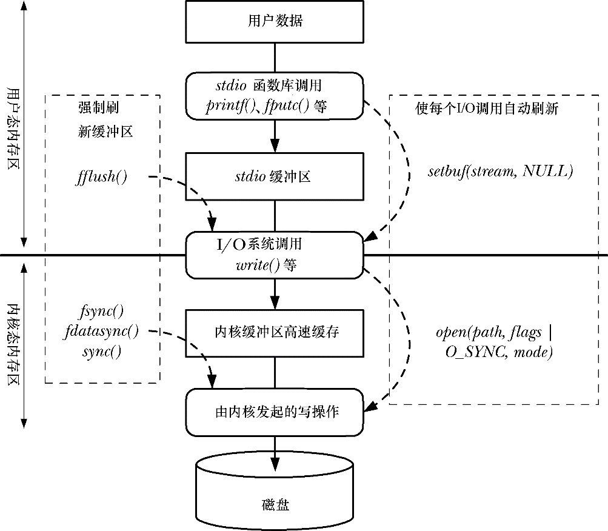
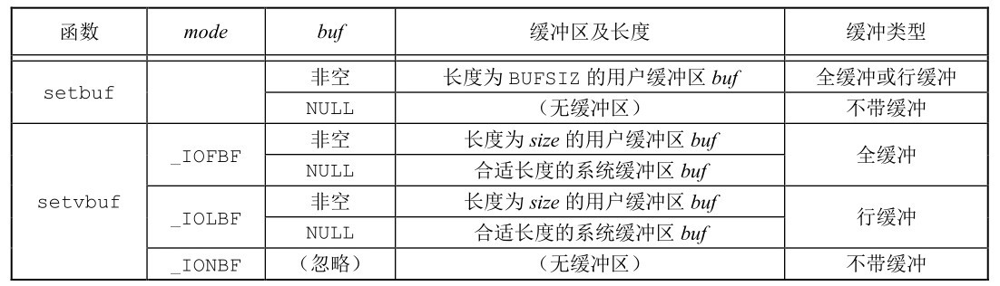
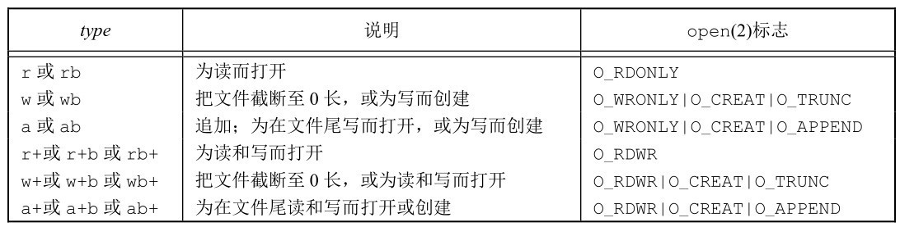
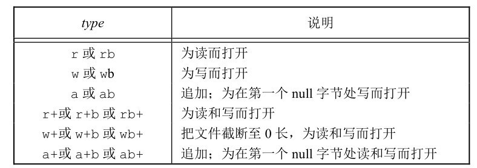

# 第五章 标准I/O库

[toc]



#### 5.2 流和FILE对象

**对于标准I/O库，它们的操作是围绕流（stream）进行的，当用标准I/O库打开或创建一个文件时，我们已使一个流与一个文件相关联。**

```c
#include <stdio.h>
#include <wchar.h>

int fwide(FILE *fp, int mode);
```

**根据mode参数的不同值，fwide函数执行不同的工作。**

- mode参数值为负，fwide将试图使指定的流是字节定向的。
- mode参数值为正，fwide将试图使指定的流是宽定向的。
- mode参数值为0，fwide将不试图设置流的定向，但返回标识该流定向的值。

#### 5.3 标准输入、标准输出和标准错误

**这3个标准I/O流通过预定义文件指针stdin、stdout和stderr加以引用。这3个文件指针定义在头文件<stdio.h>中。**

#### 5.4 缓冲

**标准I/O库提供缓冲的目的是尽可能减少使用read和write调用的次数**

1. **全缓冲** 在填满I/O缓冲区后才执行实际I/O操作。
2. **行缓冲** 当在输入和输出中遇到换行符时，标准I/O库执行I/O操作。
3. **不带缓冲** 标准I/O库不对字符进行缓冲储存。

**更改缓冲类型**

```c
#include <sidio.h>

void setbuf(FILE *restrict fp, char *restrict buf);
int setvbuf(FILE *restrict fp, char *restrict buf, int mode, size_t size);

// 强制冲洗一个流
int fflush(FILE *fp);
```

**mode参数**
- `_IOFBF` 全缓冲
- `_IOLBF` 行缓冲
- `_IONBF` 不带缓冲

    *如果指定一个不带缓冲的流，则忽略`buf`和`size`参数。如果指定全缓冲或行缓冲，则buf和size可选择地指定一个缓冲区及其长度。
    如果该流是带缓冲的，而buf是NULL，则标准I/O库将自动地为该流分配适当长度的缓冲区。适当长度指的是由常量BUFSIZ所指定的值。*



#### 5.5 打开流

```c
#include <stdio.h>

FILE *fopen(const char *restrict pathname, const char *restrict type);
FILE *freopen(const char *restrict pathname, const char *restrict type, FILE *restrict fp);
FILE *fdopen(int fd, const char *type);

int fclose(FILE *fp);
```

**区别**

1. `fopen`函数打开路径名为`pathname`的一个指定的文件。
2. `freopen`函数在一个指定的流上打开一个指定的文件，如若该流已经打开，则先关闭该流。
若该流已经定向，则使用`freopen`清除该定向。此函数一般用于将一个指定的文件打开为一个预定义的流：标准输入、标准输出或标准错误。
3. `fdopen`函数取一个已有的文件描述符，并使一个标准的I/O流与该描述符相结合。

**`type`参数**



#### 5.6 读和写流

1. 每次一个字符的I/O。一次读或写一个字符，如果流是带缓冲的，则标准I/O函数处理所有缓冲。
2. 每次一行的I/O。如果想要一次读或写一行，则使用`fgets`和`fputs`。每行都以一个换行符终止。当调用`fgets`时，应说明能处理的最大行长。5.7节将说明这两个函数。
3. 直接 I/O。`fread`和`fwrite`函数支持这种类型的I/O。每次 I/O操作读或写某种数量的对象，而每个对象具有指定的长度。

**输入函数**

```c
#include <stdio.h>

int getc(FILE *fp);
int fgetc(FILE *fp);
// getc(stdin);
int getchar(void);
```

**结束标志**

```c
#include <stdio.h>

int ferror(FILE *fp);
int feof(FILE *fp);

void clearerr(FILE *fp);
```

**输出函数**

```c
#include <stdio.h>

int putc(int c, FILE *fp);
int fputc(int c, FILE *fp);
// putc(c, stdout);
int putchar(int c);
```

**fgetc和getc他们的区别并不是在他们的使用上，而是在他们的实现上！具体来说，就是带f的(fgetc、fputc)实现的时候是通过函数来实现的，而不带f(putc、getc)的，实现的时候是通过宏定义来实现的**

#### 5.7 每行一次I/O

**输入一行**

```c
#include <stdio.h>

char *fgets(char *restrict buf, int n，FILE *restrict fp);
// 从标准输入读
char *gets(char *buf);
```

**输出一行**

```c
#include <stdio.h>

int fputs(const char *restrict str, FILE *restrict fp);
int puts(const char *str);
```

#### 5.9 二进制I/O

```c
#include <stdio.h>

size_t fread(void *restrict ptr, size_t size, size_t nobj, FILE *restrict fp);
size_t fwrite(const void *restrict ptr, size_t size, size_t nobj, FILE *restrict fp);
```

**常见用法**

1. 读或写一个二进制数组。例如，为了将一个浮点数组的第 2～5 个元素写至一文件上，可以编写如下程序：

```c
float data[10];
if (fwrite(&data[2], sizeof(float), 4, fp) != 4)
    err_sys("fwrite error");
```

2. 读或写一个结构。例如，可以编写如下程序：

```c
struct {
    short count;
    long　　total;
    char　　name[NAMESIZE];
} item;
if (fwrite(&item, sizeof(item), 1, fp) != 1)
    err_sys("fwrite error");
```

#### 5.10 定位流

1. `ftell`和`fseek`函数。这两个函数自 V7 以来就存在了，但是它们都假定文件的位置可以存放在一个长整型中。
2. `ftello`和`fseeko`函数。Single UNIX Specification引入了这两个函数，使文件偏移量可以不必一定使用长整型。它们使用off_t数据类型代替了长整型。
3. `fgetpos`和`fsetpos`函数。这两个函数是由ISO C引入的。它们使用一个抽象数据类型fpos_t记录文件的位置。这种数据类型可以根据需要定义为一个足够大的数，用以记录文件位置。

```c
#include <stdio.h>

// 返回值：若成功，返回当前文件位置指示；若出错，返回-1L
long ftell(FILE *fp);
// 返回值：若成功，返回0；若出错，返回−1
int fseek(FILE *fp, long offset, int whence);

void rewind(FILE *fp);

// 返回值：若成功，返回当前文件位置；若出错，返回(off_t)-1
off_t ftello(FILE *fp);
// 返回值：若成功，返回0；若出错，返回−1
int fseeko(FILE *fp, off_t offset, int whence);

int fgetpos(FILE *restrict fp, fpos_t *restrict pos);
int fsetpos(FILE *fp, const fpos_t *pos);
```

#### 5.11 格式化I/O


#### 5.13 临时文件

```c
#include <stdio.h>

char *tmpnam(char *ptr);
FILE *tmpfile(void);
```

**tmpfile 创建一个临时二进制文件（类型wb+），在关闭该文件或程序结束时将自动删除这种文件。**

```c
#include <stdlib.h>

char *mkdtemp(char *template);
int mkstemp(char *template);
```

**mkdtemp函数创建了一个目录，该目录有一个唯一的名字；mkstemp函数创建了一个文件，该文件有一个唯一的名字。名字是通过template字符串进行选择的。这个字符串是后6位设置为XXXXXX 的路径名。函数将这些占位符替换成不同的字符来构建一个唯一的路径名。如果成功的话，这两个函数将修改template字符串反映临时文件的名字。**

**mkstemp创建的临时文件并不会自动删除。如果希望从文件系统命名空间中删除该文件，必须自己对它解除链接**

#### 5.14 内存流

```c
#include <stdio.h>

FILE *fmemopen(void *restrict buf, size_t size, const char *restrict type);
```

自定义的缓冲区相当与内核高速缓冲区和磁盘文件

**fmemopen 函数允许调用者提供缓冲区用于内存流：buf 参数指向缓冲区的开始位置，size参数指定了缓冲区大小的字节数。如果buf参数为空，fmemopen函数分配size字节数的缓冲区。在这种情况下，当流关闭时缓冲区会被释放。**

**`type`参数**




# 习题

**5.1 用setvbuf实现setbuf。**

> [5_1](./5_1.c)

**5.2 图5-5中的程序利用每次一行I/O（fgets和fputs函数）复制文件。若将程序中的MAXLINE改为4，当复制的行超过该最大值时会出现什么情况？对此进行解释。**

> `fgets`读入数据直到遇到换行符或缓冲区满，`fputs`从缓冲区读直到`null`，会执行多次循环

**5.3 printf返回0值表示什么？**

> `printf`函数的返回值是输出的字符的长度

**5.4 下面的代码在一些机器上运行正确，而在另外一些机器运行时出错，解释问题所在。**
```c
#include <stdio.h>
int main(void)
{
    char c;
    while ((c = getchar()) != EOF)
        putchar(c);
}
```
> `getchar()`返回`int`类型，无符号字符类型会进入死循环

**5.5 对标准I/O流如何使用fsync函数（见3.13节）？**

> 先刷新内存缓冲区到内核高速缓冲区，再掉用`fsync`函数才有效

**5.6 在图1-7和图1-10程序中，打印的提示信息没有包含换行符，程序也没有调用fflush函数，请解释输出提示信息的原因是什么？**

**5.7 基于BSD的系统提供了funopen的函数调用使我们可以拦截读、写、定位以及关闭一个流的调用。使用这个函数为FreeBSD和Mac OS X实现fmemopen。**


# 补充

#### ferror

#### strerror


