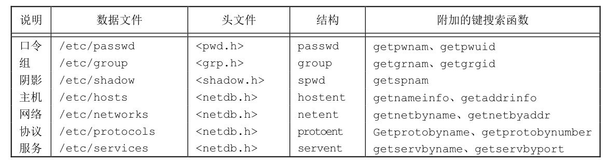
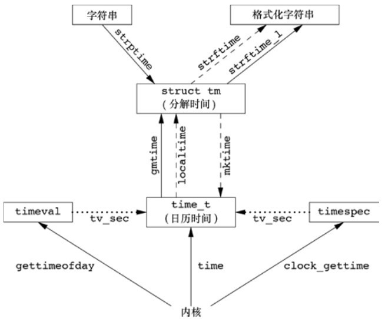

# 第六章 系统数据文件和信息

[toc]

#### 6.2 口令文件

**口令文件是`/etc/passwd`,每个字段用冒号分隔**


**两个获取口令文件项的函数**

```c
#include<pwd.h>

struct passwd *getpwuid(uid_t uid);
struct passwd *getpwnam(const char *name);
```

**查看整个口令文件**

```c
#include <pwd.h>

// 返回值：若成功，返回指针；若出错或到达文件尾端，返回NULL
// 调用一次位置变化一次
struct passwd *getpwent(void);
// 回到开头
void setpwent(void);
// 关闭文件
void endpwent(void);
```

[例子](./use_pwd.c)

#### 6.3 阴影口令

**经过单向加密的口令存放在阴影口令文件中`/etc/shadow`**


**访问阴影口令文件**

```c
#include <shadow.h>

// 两个函数返回值：若成功，返回指针；若出错，返回NULL
struct spwd *getspnam(const char *name);
struct spwd *getspent(void);
void setspent(void);
void endspent(void);
```

[例子](./use_sd.c)

#### 6.4 组文件


```c
#include <grp.h>

// 两个函数返回值：若成功，返回指针；若出错，返回NULL
struct group *getgrgid(gid_t gid);
struct group *getgrnam(const char *name);
```

**搜索整个组文件**

```c
#include <grp.h>

// 返回值：若成功，返回指针；若出错或到达文件尾端，返回NULL
struct group *getgrent(void);
void setgrent(void);
void endgrent(void);
```

#### 6.7 其他数据文件

**一般情况下，对于每个数据文件至少有3个函数**

1. **`get`** 读下一个记录，如果需要，还会打开该文件。此种函数通常返回指向一个结构的指针。当已达到文件尾端时返回空指针。大多数get函数返回指向一个静态存储类结构的指针，如果要保存其内容，则需复制它。
2. **`set``** 打开相应数据文件（如果尚末打开），然后反绕该文件。如果希望在相应文件起始处开始处理，则调用此函数。
3. **`end`** 关闭相应数据文件。如前所述，在结束了对相应数据文件的读、写操作后，总应调用此函数以关闭所有相关文件。



#### 6.8 登录账户记录

**utmp文件记录当前登录到系统的各个用户；wtmp文件跟踪各个登录和注销事件**

```c
struct utmp {
    char ut_line[8]; /* tty line: "ttyh0", "ttyd0", "ttyp0", ... */
    char ut_name[8]; /* login name */
    long　ut_time;　　/* seconds since Epoch */
};
```

#### 6.9 系统标识

```
#include <sys/utsname.h>

int uname(struct utsname *name);

struct utsname {
    char sysname[ ]; /* name of the operating system */
    char nodename[ ]; /* name of this node */
    char release[ ]; /* current release of operating system */
    char version[ ]; /* current version of this release */
    char machine[ ]; /* name of hardware type */
};
```

#### 6.10 时间和日期例程

**获取自公元1970年1月1日00:00:00的秒数**

```c
#include <time.h>

time_t time(time_t *calptr);
```


```c
#include <sys/time.h>

int clock_gettime(clockid_t clock_id, struct timespec *tsp);
```

**clock_getres函数把参数tsp指向的timespec结构初始化为与clock_id参数对应的时钟精度。**

```c
#include <sys/time.h>

int clock_getres(clockid_t clock_id, struct timespec *tsp);
```

**设置时间**

```c
#include <sys/time.h>

int clock_getres(clockid_t clock_id, struct timespec *tsp);
```

**两个函数localtime和gmtime将日历时间转换成分解的时间**

```c
#include <time.h>

struct tm *gmtime(const time_t *calptr);
struct tm *localtime(const time_t *calptr);
```

```c
struct tm {　　　　   /* a broken-down time                    */
    int tm_sec;　　　 /* seconds after the minute: [0 - 60]    */
    int tm_min;　　　 /* minutes after the hour: [0 - 59]      */
    int tm_hour;　　  /* hours after midnight: [0 - 23]        */
    int tm_mday;　　  /* day of the month: [1 - 31]            */
    int tm_mon;　　　 /* months since January: [0 - 11]        */
    int tm_year;　　  /* years since 1900                      */
    int tm_wday;　　  /* days since Sunday: [0 - 6]            */
    int tm_yday;　　  /* days since January 1: [0 - 365]       */
    int tm_isdst;　　 /* daylight saving time flag: <0, 0, >0  */
};
```



**函数mktime以本地时间的年、月、日等作为参数，将其变换成time_t值**

```c
#include <time.h>

time_t mktime(struct tm *tmptr);
```

**定制产生的字符串**

```c
#include <time.h>

size_t strftime(char *restrict buf, size_t maxsize,
                const char *restrict format,
                const struct tm *restrict tmptr);
size_t strftime_l(char *restrict buf, size_t maxsize,
                  const char *restrict format,
                  const struct tm *restrict tmptr, locale_t locale);
```

# 习题

**6.1 如果系统使用阴影文件，那么如何取得加密口令？**

**6.2 假设你有超级用户权限，并且系统使用了阴影口令，重新考虑上一道习题。**

**6.3 编写一程序，它调用uname并输出utsname结构中的所有字段，将该输出与uname(1)命令的输出结果进行比较。**

> [uname](./use_time.c)

**6.4 计算可由time_t数据类型表示的最近时间。如果超出了这一时间将会如何?**

**6.5 编写一程序，获取当前时间，并使用 strftime 将输出结果转换为类似于 date(1)命令的默认输出。将环境变量TZ设置为不同值，观察输出结果。**

