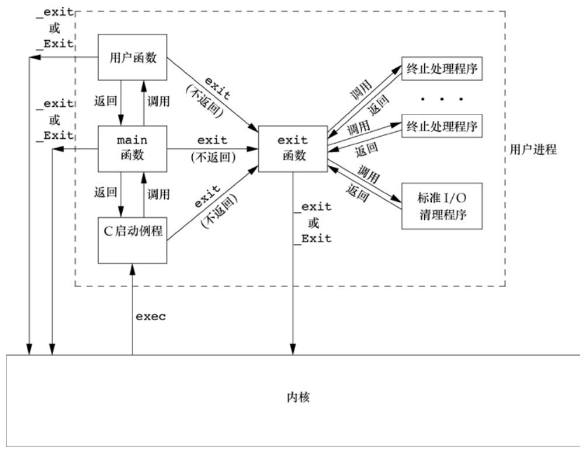
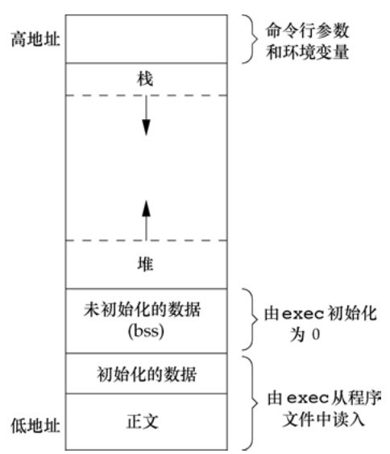
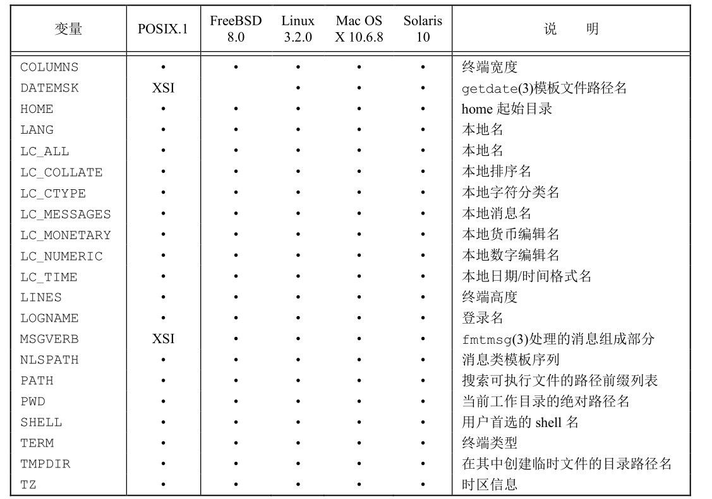
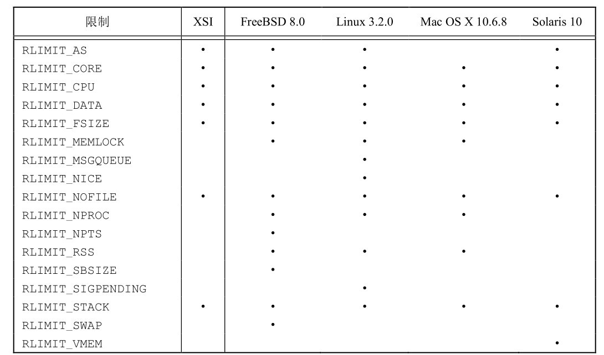

# 第七章 进程环境

[toc]

#### 7.2 `main`函数

**C程序总是从main函数开始执行。main函数的原型是：**
```c
int main(int argc, char *argv[]);
```
*当内核执行C程序时，在调用main前先调用一个特殊的启动例程。可执行程序文件将此启动例程指定为程序的起始地址，而连接编辑器则由C编译器调用。启动例程从内核取得命令行参数和环境变量值，然后为按上述方式调用main函数做好安排。*

#### 7.3 进程终止（很重要）

**正常**

1. 从main返回；
2. 调用exit；
3. 调用_exit或_Exit；
4. 最后一个线程从其启动例程返回（11.5节）；
5. 从最后一个线程调用pthread_exit（11.5节）。

**异常**

6. 调用abort（10.17节）；
7. 接到一个信号（10.2节）；
8. 最后一个线程对取消请求做出响应（11.5节和12.7节）。

###### 1. 退出函数

**_exit和_Exit立即进入内核，exit则先执行一些清理处理，然后返回内核**

```c
#include <stdlib.h>
void exit(int status);
void _Exit(int status);

#include <unistd.h>
void _exit(int status);
```

###### 2. 函数`atexit`

**一个进程可以登记多至32个函数，这些函数将由exit自动调用，调用atexit函数来登记这些函数**

```c
#include <stdlib.h>

int atexit(void (*func)(void));
```

*atexit 的参数是一个函数地址，当调用此函数时无需向它传递任何参数，也不期望它返回一个值。exit调用这些函数的顺序与它们登记时候的顺序相反。同一函数如若登记多次，也会被调用多次*



#### 7.5 环境表

```c
extern char **environ;
```

#### 7.6 C程序的存储空间布局

- **正文段**

    这是由CPU执行的机器指令部分。
    通常，正文段是可共享的，所以即使是频繁执行的程序（如文本编辑器、C编译器和shell等）在存储器中也只需有一个副本，另外，正文段常常是只读的，以防止程序由于意外而修改其指令。

- **初始化数据段**

    通常将此段称为数据段，它包含了程序中需明确地赋初值的变量。

- **未初始化数据段**

    通常将此段称为bss段，在程序开始执行之前，内核将此段中的数据初始化为0或空指针。

- **栈**

    自动变量以及每次函数调用时所需保存的信息都存放在此段中。每次函数调用时，其返回地址以及调用者的环境信息（如某些机器寄存器的值）都存放在栈中。然后，最近被调用的函数在栈上为其自动和临时变量分配存储空间。通过以这种方式使用栈，C递归函数可以工作。递归函数每次调用自身时，就用一个新的栈帧，因此一次函数调用实例中的变量集不会影响另一次函数调用实例中的变量。

- **堆**

    通常在堆中进行动态存储分配。由于历史上形成的惯例，堆位于未初始化数据段和栈之间。



#### 7.7 共享库

共享库使得可执行文件中不再需要包含公用的库函数，而只需在所有进程都可引用的存储区中保存这种库例程的一个副本。程序第一次执行或者第一次调用某个库函数时，用动态链接方法将程序与共享库函数相链接。这减少了每个可执行文件的长度，但增加了一些运行时间开销。这种时间开销发生在该程序第一次被执行时，或者每个共享库函数第一次被调用时。共享库的另一个优点是可以用库函数的新版本代替老版本而无需对使用该库的程序重新连接编辑（假定参数的数目和类型都没有发生改变）。

#### 7.8 存储空间分配

```c
#include <stdlib.h>

// 指定字节数，初始值不确定
void *malloc(size_t size);
// 指定数量，指定长度，初始值0
void *calloc(size_t nobj, size_t size);
// 增加或减少以前分配区的长度。当增加长度时，可能需将以前分配区的内容
// 移到另一个足够大的区域，以便在尾端提供增加的存储区，而新增区域内的初始值则不确定。
void *realloc(void (ptr), size_t newsize);
void free(void *ptr);
```

#### 7.9 环境变量

```c
#include <stdlib.h>

// 返回指向与name关联的value的指针
char *getenv(const char *name);
```



**设置环境变量。影响的只是当前进程及其后生成和调用的任何子进程的环境，但不能影响父进程的环境。尽管如此，修改环境表的能力仍然是很有用的。**

```c
#include <stdlib.h>

int putenv(char *str);
int setenv(const char *name, const char *value, int rewrite);
int unsetenv(const char *name);
```

- `putenv`取形式为name=value的字符串，将其放到环境表中。如果name已经存在，则先删除其原来的定义。
- `setenv`将name设置为value。如果在环境中name已经存在，那么若rewrite非0，则首先删除其现有的定义；若rewrite为0，则不删除其现有定义。
- `unsetenv`删除name的定义。即使不存在这种定义也不算出错。

#### 7.10 函数`setjmp`和`longjmp`

[例子](./use_jmp.c)

#### 7.11 函数`getrlimit`和`setrlimit`

**每个进程都用一组资源限值，它们可以用来限制进程能够消耗的各种系统资源。
如在执行任意一个程序之前如果不想让它消耗太多资源，则可以设置该进程的资源限制。
使用shell的内置命令ulimit可以设置shell的资源限制（在C shell中是limit）。
shell创建用来执行用户命令的进程会继承这些限制。**

```c
#include <sys/resource.h>

// resource参数标识出了需读取或修改的资源限制 rlptr参数用来返回限制值
int getrlimit(int resource, struct rlimit *rlptr);
int setrlimit(int resource, const struct rlimit *rlptr);
```

**`resource`**



```c
struct rlimit {
    rlim_t rlim_cur; /* soft limit: current limit */
    rlim_t rlim_max; /* hard limit: maximum value for rlim_cur */
};
```

1. 任何一个进程都可将一个软限制值更改为小于或等于其硬限制值。
2. 任何一个进程都可降低其硬限制值，但它必须大于或等于其软限制值。这种降低，对普通用户而言是不可逆的。
3. 只有超级用户进程可以提高硬限制值。

# 习题

**7.1 在Intel x86系统上，使用Linux，如果执行一个输出“hello, world”的程序但不调用exit或return，则程序的返回代码为13（用shell检查），解释其原因。**

> `printf`的返回值

**7.2 图7-3中的printf函数的结果何时才被真正输出？**

**7.3 是否有方法不使用（a）参数传递、（b）全局变量这两种方法，将main中的参数argc和argv传递给它所调用的其他函数？**

**7.4 在有些 UNIX 系统实现中执行程序时访问不到其数据段的 0 单元，这是一种有意的安排，为什么？**

**7.5 用C语言的typedef为终止处理程序定义了一个新的数据类型Exitfunc，使用该类型修改atexit的原型。**

> `int atexit(Exitfunc *fuc);`

**7.6 如果用calloc分配一个long型的数组，数组的初始值是否为0？如果用calloc分配一个指针数组，数组的初始值是否为空指针？**

> 每一bit是0

**7.7 在7.6节结尾处size命令的输出结果中，为什么没有给出堆和栈的大小？**

> 只有通过`exec`，才会分配堆栈

**7.8 为什么7.7节中两个文件的大小（879 443和8 378）不等于它们各自文本和数据大小的和？**

**7.9 为什么7.7节中对于一个简单的程序，使用共享库以后其可执行文件的大小变化如此巨大？**

> 共享库使得可执行文件中不再需要包含公用的库函数，而在需要在所有进程都可以引用的存储区中保存这种库例程的一个副本。

**7.10 在7.10节中我们已经说明为什么不能将一个指针返回给一个自动变量，下面的程序是否正确？**

```c
int f1(int val)
{
    int num = 0;
    int *ptr = &num;
    if (val == 0) {
        int val;
        val = 5;
        ptr = &val;
    }
    return(*ptr + 1);
}
```

> 不正确，`val`会自动销毁

# 补充

#### `getopt`和`getopt_long`函数

**参数解析函数**

#### 动态装载库

```c
#include <dlfcn.h>

void *dlopen(const char* filename, int flag);
char *dlerror(void);
void *dlsym(void* handle, const char* symbol);
int dlclose(void* handle);
```

**Link with -ldl**


