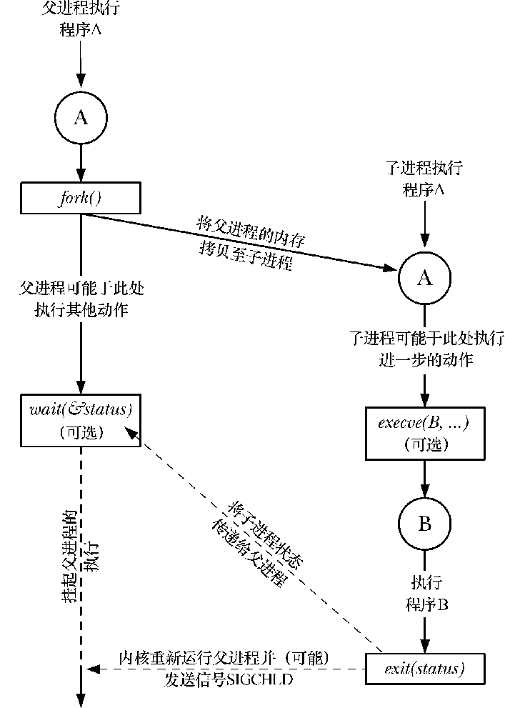

# 第八章 进程控制

[toc]

#### 8.2 进程标识

**非负整型表示唯一进程ID**

```c
#include <unistd.h>

// 进程ID
pid_t getpid(void);
// 父进程ID
pid_t getppid(void);
// 实际用户ID
uid_t getuid(void);
// 有效用户ID
uid_t geteuid(void);
// 实际组ID
gid_t getgid(void);
// 有效组ID
gid_t getegid(void);

```

顺次向下使用

r: 真实ID
e: 有效ID


#### 8.3 函数`fork`

```c
#include <unistd.h>

// 子进程返回0，父进程返回子进程ID
pid_t fork(void);
```

- 子进程ID返回给父进程的理由是：因为一个进程的子进程可以有多个，并且没有一个函数使一个进程可以获得其所有子进程的进程 ID。
- fork 使子进程得到返回值 0 的理由是：一个进程只会有一个父进程，所以子进程总是可以调用 getppid 以获得其父进程的进程 ID（进程ID 0总是由内核交换进程使用，所以一个子进程的进程ID不可能为0）。
- 子进程和父进程继续执行fork调用之后的指令。
  子进程是父进程的副本。例如，子进程获得父进程数据空间、堆和栈的副本。
  注意，这是子进程所拥有的副本。父进程和子进程并不共享这些存储空间部分。父进程和子进程共享正文段。
- pid ppid 不同
- 未决信号和文件锁不继承
- 资源利用清零

**需要fflush()**


#### 8.4 函数`vfork`

vfork保证子进程先运行，在它调用exec或exit之后父进程才可能被调度运行，当子进程调用这两个函数中的任意一个时，父进程会恢复运行。

**计算方法**

1. 分块
2. 交叉分配
3. 池（取任务）

#### 8.5 函数`exit`


#### 8.6 函数`wait`和`waitpid`


```c
#include <sys/wait.h>

pid_t wait(int *statloc);
pid_t waitpid(pid_t pid, int *statloc, int options);
```

**区别**

- 在一个子进程终止前，`wait`使其调用者阻塞，而`waitpid`有一选项，可使调用者不阻塞。
- `waitpid`并不等待在其调用之后的第一个终止子进程，它有若干个选项，可以控制它所等待的进程。

#### 8.7 函数`waitid`

#### 8.8 函数`wait3`和`wait4`

#### 8.9 竞争条件

#### 8.10 函数`exec`

子进程往往要调用一种exec函数以执行另一个程序。当进程调用一种exec函数时，该进程执行的程序完全替换为新程序，而新程序则从其main函数开始执行。因为调用exec并不创建新进程，所以前后的进程ID并未改变。exec只是用磁盘上的一个新程序替换了当前进程的正文段、数据段、堆段和栈段。

```c
#include <unistd.h>

int execl(const char *pathname, const char *arg0, ...);
int execv(const char *pathname, char *const argv[]);
int execle(const char *pathname, const char *arg0, ...);
int execve(const char *pathname, char *const argv[], char *const envp[]);
int execlp(const char *filename, const char *arg0, ...);
int execvp(const char *filename, char *const argv[]);
int fexecve(int fd, char *const argv[], char *const envp[]);
```



#### 8.11 更改用户ID和更改组ID

```c
int setuid(uid_t uid);
int seteuid(uid_t uid);
int setreuid(uid_t ruid, uid_t euid);
int setregid(gid_t rgid, gid_t egid);
```

#### 8.12 解释器文件

```sh
#!/bin/cat

ls
```

1. 装载解释器
2. 解释文件内容

#### 8.13 函数`system`

**execute a shell command**

```c
#include <stdlib.h>

int system(const char *command);
```

#### 8.14 进程会计

`acct()`

#### 8.15 用户标识

#### 8.16 进程调度

#### 8.17 进程时间


# 补充

#### 守护进程

**单实例守护进程**

*见第九章会话相关知识*

1. 标准输入输出重定向
2. `setsid()`创建新会话
3. 标志：ps axj     PPID = 1; PID = PGID = SID;

#### 锁文件

/var/run/*.pid

#### 启动脚本文件


#### 系统日志

`syslogd`服务写系统日志

```c
#include <syslog.h>

void openlog(const char *ident, int option, int facility);
void syslog(int priority, const char *format, ...);
void closelog(void);

void vsyslog(int priority, const char *format, va_list ap);
```

