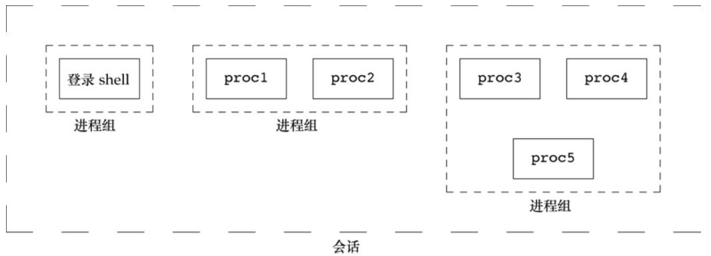
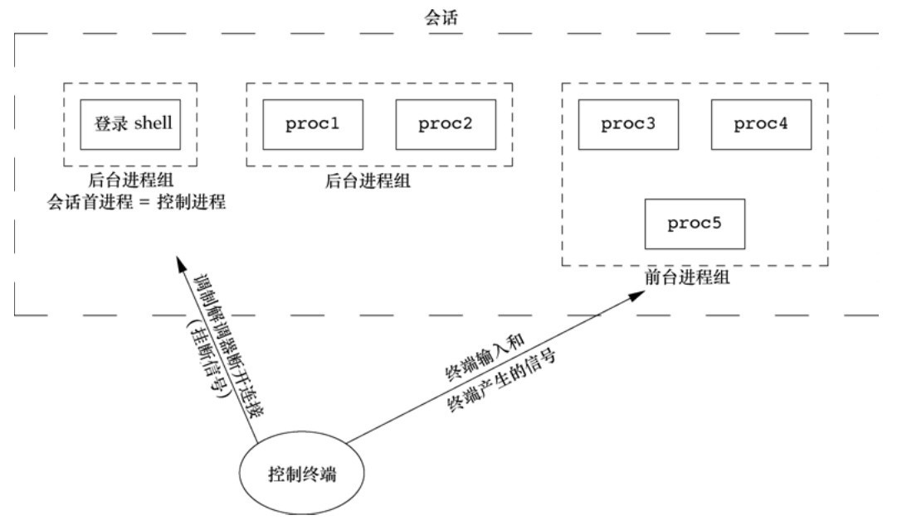

# 第九章 进程关系

[toc]

#### 9.4 进程组

- 进程组是一个或多个进程的集合。
- 同一进程组中的各进程接收来自同一终端的各种信号。
- 每个进程组有一个唯一的进程组ID。
- 进程组ID类似于进程ID——它是一个正整数，并可存放在pid_t数据类型中。

```c
#include <unistd.h>

// 函数getpgrp返回调用进程的进程组ID。
pid_t getpgrp(void);
```

每个进程组有一个组长进程。组长进程的进程组ID等于其进程ID。

进程调用 setpgid 可以加入一个现有的进程组或者创建一个新进程组。

```c
#include <unistd.h>

int setpgid(pid_t pid, pid_t pgid);
```

*setpgid函数将pid进程的进程组ID设置为pgid。
如果这两个参数相等，则由pid指定的进程变成进程组组长。
如果pid是0，则使用调用者的进程ID。
如果pgid是0，则由pid指定的进程ID用作进程组ID。*

#### 9.5 会话

**会话（session）是一个或多个进程组的集合。**



```c
#include <unistd.h>

// 建立一个新会话
pid_t setsid(void);
```

如果调用此函数的进程不是一个进程组的组长，则此函数创建一个新会话。

1. 该进程变成新会话的会话首进程（session leader，会话首进程是创建该会话的进程）。此时，该进程是新会话中的唯一进程。
2. 该进程成为一个新进程组的组长进程。新进程组ID是该调用进程的进程ID。
3. 该进程没有控制终端。如果在调用 setsid 之前该进程有一个控制终端，那么这种联系也被切断。

如果该调用进程已经是一个进程组的组长，则此函数返回出错。

*通常先调用fork，然后使其父进程终止，而子进程则继续。因为子进程继承了父进程的进程组ID，而其进程ID则是新分配的，两者不可能相等，这就保证了子进程不是一个进程组的组长。*


#### 9.6 控制终端



**会话和进程组还有一些其他特性。**

- 一个会话可以有一个控制终端（controlling terminal）。这通常是终端设备（在终端登录情况下）或伪终端设备（在网络登录情况下）。
- 建立与控制终端连接的会话首进程被称为控制进程（controlling process）。
- 一个会话中的几个进程组可被分成一个前台进程组（foreground process group）以及一个或多个后台进程组（background process group）。
- 如果一个会话有一个控制终端，则它有一个前台进程组，其他进程组为后台进程组。
- 无论何时键入终端的中断键（常常是Delete或Ctrl+C），都会将中断信号发送至前台进程组的所有进程。
- 无论何时键入终端的退出键（常常是Ctrl+\），都会将退出信号发送至前台进程组的所有进程。
- 如果终端接口检测到调制解调器（或网络）已经断开连接，则将挂断信号发送至控制进程（会话首进程）。

#### 9.7 函数`tcgetpgrp`、`tcsetpgrp`和`tcgetsid`

```c
#include <unistd.h>

pid_t tcgetpgrp(int fd);
int tcsetpgrp(int fd, pid_t pgrpid);


#include <termios.h>

pid_t tcgetsid(int fd);
```

#### 9.8 作业控制


